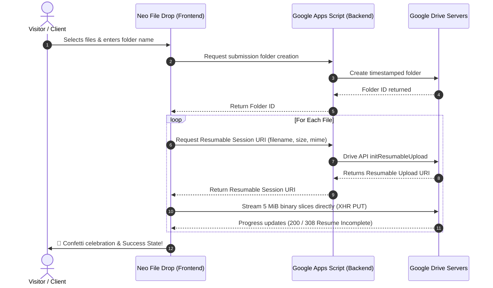

# 📁 Neo File Drop

<p align="center">
  
</p>

<p align="center">
  <strong>A modern, login-free, high-speed file drop portal for receiving files directly into your personal or workspace Google Drive.</strong>
</p>

<p align="center">
  <a href="#-key-features">Features</a> •
  <a href="#-how-it-works">Architecture</a> •
  <a href="#-step-by-step-setup-guide">Setup Guide</a> •
  <a href="#-environment-variables">Configuration</a> •
  <a href="#-faq--troubleshooting">Troubleshooting</a> •
  <a href="#-license">License</a>
</p>

---

## 💡 Why Neo File Drop?

Do you frequently need clients, students, friends, or coworkers to send you large files (videos, archives, RAW photos, design assets), but:

- ❌ You don't want to force them to sign into a Google account or register anywhere?
- ❌ You don't want to expose your Google Drive folders or let uploaders see other people's files?
- ❌ Traditional email attachments cap at 25 MB?
- ❌ Paid services like WeTransfer or Dropbox charge monthly subscriptions?

**Neo File Drop solves this.** It provides a public, mobile-friendly upload portal where anyone can drag, drop, and upload files straight into a timestamped folder inside your Google Drive. 

**Best of all: It is 100% free, serverless, and costs $0/month to host.**

---

## ✨ Key Features

- 🚀 **Zero Login Required**: Uploaders don't need a Google account or any credentials. Open the link and upload immediately.
- ⚡ **Direct Resumable Uploads (1 GB+)**: Uses Google Drive API v3's official resumable upload protocol. Files are streamed in 5 MiB binary slices directly from the browser to Google's edge servers with zero server memory buffering.
- 🔄 **Auto-Pause & Network Auto-Resume**: Recovers seamlessly from Wi-Fi drops or network disconnects. When reconnected, it queries Google Drive for the exact byte offset (`Content-Range: bytes */TOTAL`) and resumes right where it left off.
- 📁 **Organized Submissions**: Every upload batch generates its own neat folder in your Drive:
  ```text
  [Folder Name] - [YYYY-MM-DD] - [6-Char UID]
  ```
- 🔒 **One-Way Privacy**: Uploaders can only push files; they **cannot view, list, or download** anything else in your Drive.
- 🎨 **Interactive Mascot Progress**: Neo tracks your transfer speed (KB/s or MB/s), displays an accurate time-remaining countdown (ETA), and celebrates with multi-stage confetti when done.
- 📱 **Mobile & Desktop Optimized**: Responsive, clean UI built with Tailwind CSS, touch-friendly dropzones, and dark mode support.
- 🌐 **100% Serverless & Free**: Deploys in minutes to Netlify, Vercel, or GitHub Pages with a free Google Apps Script backend.

---

## 🏗️ How It Works



---

## 🚀 Step-by-Step Setup Guide

Follow this guide to get your own file portal running in under 10 minutes.

### Step 1: Create a Google Drive Destination Folder

1. Open [Google Drive](https://drive.google.com).
2. Create a new folder where you want uploaded files to be saved (e.g., `Client Submissions` or `Neo File Drop`).
3. Open the folder and copy the **Folder ID** from your browser's address bar:
   ```text
   https://drive.google.com/drive/folders/1a2b3c4d5e6f7g8h9i0jKLMNOPQRSTUVW
                                          └─── THIS IS YOUR PARENT FOLDER ID ───┘
   ```

---

### Step 2: Set Up the Google Apps Script Backend

1. Go to [script.google.com](https://script.google.com) and click **New project**.
2. Rename the project to `Neo File Drop Backend`.
3. In the repository's [`apps-script/`](apps-script/) folder, you will find 6 files. Copy and paste them into your Apps Script editor:
   - `Config.gs`
   - `Code.gs`
   - `DriveService.gs`
   - `UploadService.gs`
   - `Validation.gs`
   - `Security.gs`
4. In `Config.gs`, replace `YOUR_GOOGLE_DRIVE_FOLDER_ID_HERE` with your **Folder ID** from Step 1:
   ```javascript
   const CONFIG = {
     PARENT_FOLDER_ID: '1a2b3c4d5e6f7g8h9i0jKLMNOPQRSTUVW',
     // ...
   };
   ```
5. **Enable the Drive API**:
   - In the left sidebar of Apps Script, click the **+** next to **Services**.
   - Select **Google Drive API** (Version: `v3`).
   - Click **Add**.
6. **Deploy as a Web App**:
   - Click **Deploy** (top right) → **New deployment**.
   - Click the gear icon ⚙️ → choose **Web app**.
   - Set **Description**: `Production`.
   - Set **Execute as**: `Me (your email)`.
   - Set **Who has access**: `Anyone`. *(Crucial: allows visitors to upload without logging in)*.
   - Click **Deploy**.
   - When prompted, click **Authorize Access**, select your Google account, click **Advanced** → **Go to Neo File Drop Backend (unsafe)**, and approve permissions.
7. **Copy your Web App URL**:
   ```text
   https://script.google.com/macros/s/AKfycby.../exec
   ```

> [!TIP]
> Whenever you modify code in `apps-script/`, you must create a **New Version** via **Deploy > Manage deployments > Edit > New version** for the changes to take effect.

---

### Step 3: Configure & Deploy the Frontend

#### Option A: Deploy to Netlify (Recommended)

[](https://app.netlify.com/start/deploy?repository=https://github.com/iam-neo/Neo-File-Drop)

1. Fork or push this repository to your GitHub account.
2. Sign into [Netlify](https://app.netlify.com) and click **Add new site** → **Import an existing project**.
3. Select your repository.
4. Under **Environment variables**, add:
   | Key | Value |
   | :--- | :--- |
   | `VITE_APPS_SCRIPT_URL` | Your Google Apps Script Web App URL from Step 2 |
5. Click **Deploy Neo-File-Drop**. Your portal is live with free automatic SSL!

#### Option B: Run Locally

1. Clone your repository:
   ```bash
   git clone https://github.com/iam-neo/Neo-File-Drop.git
   cd Neo-File-Drop
   ```
2. Install dependencies:
   ```bash
   npm install
   ```
3. Create your `.env` file:
   ```bash
   cp .env.example .env
   ```
   Add your Web App URL:
   ```env
   VITE_APPS_SCRIPT_URL=https://script.google.com/macros/s/YOUR_DEPLOYMENT_ID/exec
   ```
4. Start the local development server:
   ```bash
   npm run dev
   ```
   Open `http://localhost:5173` in your browser.

---

## ⚙️ Environment Variables

| Variable | Required | Default | Description |
| :--- | :---: | :---: | :--- |
| `VITE_APPS_SCRIPT_URL` | **Yes** | `""` | The URL of your deployed Google Apps Script Web App. |

---

## 🛠️ Project Structure

```text
Neo-File-Drop/
├── apps-script/                 # Serverless Backend (Google Apps Script)
│   ├── Code.gs                  # Main router (doGet, doPost) & action dispatcher
│   ├── Config.gs                # Target parent Drive folder ID & limits
│   ├── DriveService.gs          # Subfolder creator & verification
│   ├── UploadService.gs         # Drive v3 Resumable session initiator & chunk relay
│   ├── Validation.gs            # Input sanitization & filename validation
│   └── Security.gs              # Safe JSON output & audit loggers
├── src/
│   ├── components/              # Modular UI components
│   │   ├── DropZone/            # Drag & drop file selector
│   │   ├── FileQueue/           # Queued files list with individual retry/remove
│   │   ├── UploadProgress/      # Mascot progress bar with real-time speed & ETA
│   │   ├── SuccessState/        # Celebration screen with upload batch summary
│   │   └── ...
│   ├── hooks/
│   │   ├── useUploadManager.ts  # Upload scheduler, concurrency pool & state machine
│   │   └── useFileQueue.ts      # Queue state, deduplication & progress calculations
│   ├── services/
│   │   ├── api.ts               # Apps Script communication layer
│   │   └── driveUploadService.ts# Direct XHR binary streaming & chunk management
│   └── utils/                   # Time formatting, byte formatters, folder sanitizers
├── netlify.toml                 # Netlify routing, build configuration & headers
└── package.json
```

---

## 🎨 Customizing the Portal

### Changing the Mascot Avatar
Place your mascot or logo image inside [`public/images/`](public/images/) (e.g. `public/images/neo-character.png`). It is used across the header, the animated progress bar, and the success screen.

### Modifying Concurrent Uploads
By default, the portal uploads up to **2 files simultaneously**. You can adjust this in [`src/hooks/useUploadManager.ts`](src/hooks/useUploadManager.ts#L15):
```typescript
const CONCURRENT_UPLOADS = 3; // Change to 1 for sequential, or 3+ for faster parallel transfers
```

### Changing Chunk Slice Size
Chunk size is set to **5 MiB** (strictly adhering to Google Drive's 256 KiB multiple rule). You can customize it in [`src/services/driveUploadService.ts`](src/services/driveUploadService.ts#L14):
```typescript
export const CHUNK_SIZE = 5 * 1024 * 1024; // 5 MiB
```

---

## ❓ FAQ & Troubleshooting

<details>
<summary><strong>1. Why does Google display "Google hasn't verified this app" during setup?</strong></summary>

Because you are deploying your own personal Google Apps Script project. Since the script only runs inside your own Google account to access your own Google Drive, you can safely click **Advanced** → **Go to Neo File Drop Backend (unsafe)**.
</details>

<details>
<summary><strong>2. Can people who upload files see my other Drive files?</strong></summary>

**No.** The Google Apps Script code only creates a new subfolder and returns an upload session URI for that specific folder. It exposes no methods to list, search, or read files in your Google Drive.
</details>

<details>
<summary><strong>3. What happens if an upload is interrupted?</strong></summary>

Neo File Drop monitors online status. If connection drops, it halts immediately. Once restored, it queries Google Drive for the exact byte count already saved on the server (`Content-Range: bytes */TOTAL`) and resumes from the exact next byte without restarting.
</details>

<details>
<summary><strong>4. How do I change the maximum file size?</strong></summary>

There is no arbitrary frontend file limit! Because files are sliced with `Blob.slice()` into 5 MB chunks, browser memory remains low even with multi-gigabyte files (up to Google Drive's standard 5 TB single-file maximum).
</details>

---

## 🤝 Contributing

Contributions, issues, and feature requests are welcome! Feel free to check the [issues page](https://github.com/iam-neo/Neo-File-Drop/issues).

---

## 📄 License

Distributed under the **MIT License**. Free for personal, open-source, and commercial use. See `LICENSE` for details.
